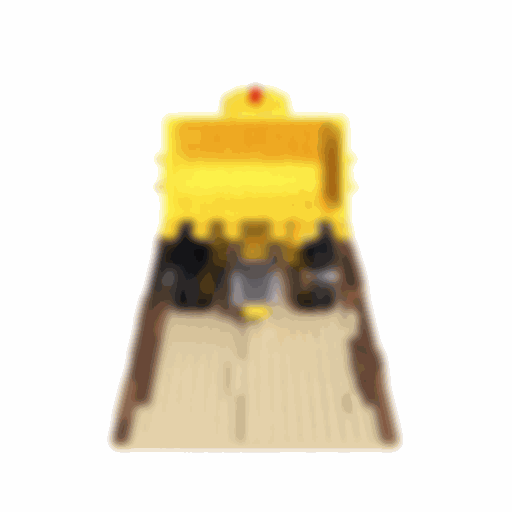

# Neural Radiance Fields (NeRF) algorithm implementation using PyTorch
Implementation of the Neural Radiance Fields(NeRF) algorithm for 3D reconstruction.

Results for reconstruction for the Lego Dataset:

    

### For Training
python3 Wrapper.py --mode 'train'

### For Testing
python3 Wrapper.py --mode 'test'
